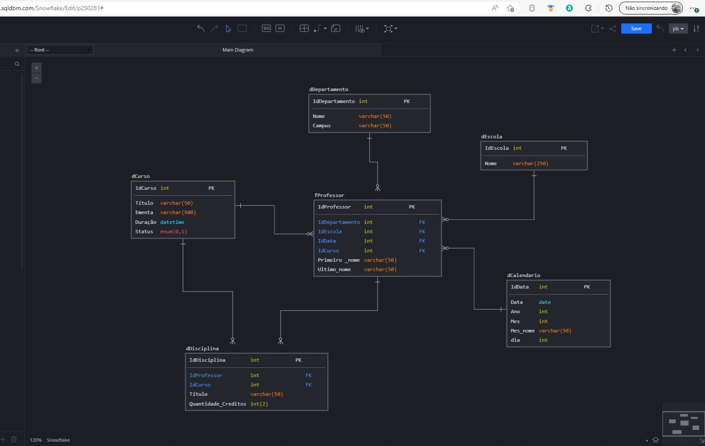

## Sobre o desenvolvimento deste trabalho

O desafio está composto em 2 partes, sendo elas:

1. Criar modelo relacional
2. a partir do modelo relacional, criar o modelo Star Schema.

Para criação do modelo banco de dados foi o site mencionado pela profª [SQL DBM](http://app.sqldbm.com/), não é possível utiliza-lo para gerar o script.sql porque a lincença é limitada a somente uma tabela, e o tempo de utilização são de 14 dias.

> São esperados como artefatos para entregas a saídas a seguir:

* Modelagem Relacional;
* Modelagem Star Schema;
* Gerar Scrit de banco de dados;
* Carregar somente as colunas das tabelas que foram utilizadas no Power BI;
* Criar a tabela dimensão calendário;
* Criar algumas análises para demonstrar o conhecimento adquirido.

>Base do modelo relacional

>A partir do modelo relacional abaixo, criar novo modelo starschema
