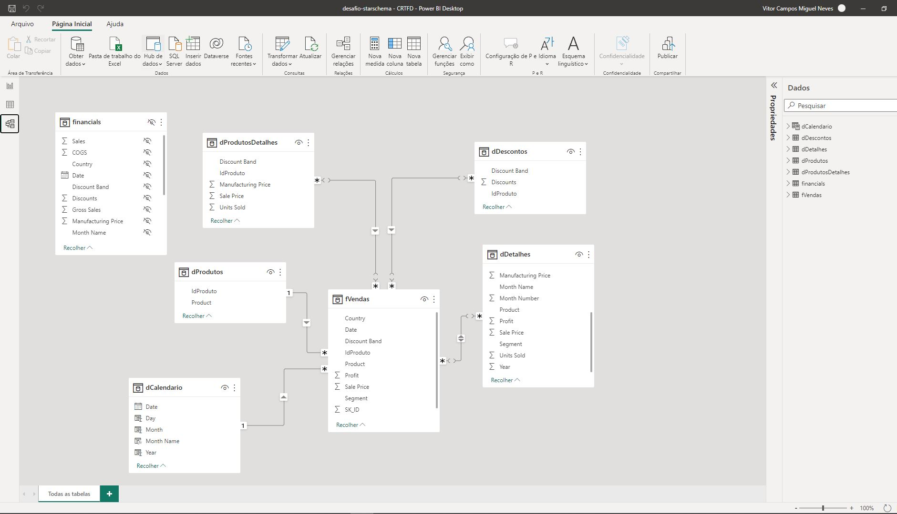

## Sobre o desenvolvimento deste trabalho

O desafio está composto em 2 partes, sendo elas:

1. Criar modelo relacional
2. a partir do modelo relacional, criar o modelo Star Schema.

<p style="text-align: justify;">Para criação do modelo banco de dados foi utilizado a fonte de dados sample_financials, da qual se derivaram seis tabelas dimensões e uma tabela fato. Para a criação da tabela dCalendário, foi utilizada o comando: ```Calenderauto()``` e partir deste resultado foi utilizado o comando: ```Year(), Month(), Day() e Format()```

> São esperados como artefatos para entregas a saídas a seguir:

* Modelagem Relacional;
* Modelagem Star Schema;
* Gerar Scrit de banco de dados;
* Carregar somente as colunas das tabelas que foram utilizadas no Power BI;
* Criar a tabela dimensão calendário;
* Criar algumas análises para demonstrar o conhecimento adquirido.

>A partir do modelo relacional abaixo, criar novo modelo starschema
